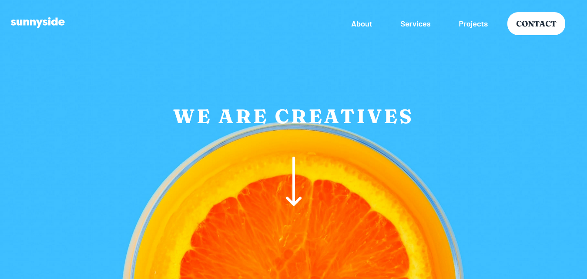

# Frontend Mentor - Sunnyside agency landing page solution

This is a solution to the [Sunnyside agency landing page challenge on Frontend Mentor](https://www.frontendmentor.io/challenges/sunnyside-agency-landing-page-7yVs3B6ef). Frontend Mentor challenges help you improve your coding skills by building realistic projects.

## Table of contents

- [Overview](#overview)
  - [The challenge](#the-challenge)
  - [Screenshot](#screenshot)
  - [Links](#links)
- [My process](#my-process)
  - [Built with](#built-with)
  - [What I learned](#what-i-learned)
  - [Continued development](#continued-development)
  - [Useful resources](#useful-resources)
- [Author](#author)
- [Acknowledgments](#acknowledgments)

## Overview

### The challenge

Users should be able to:

- View the optimal layout for the site depending on their device's screen size
- See hover states for all interactive elements on the page

### Screenshot

### Links

- Solution URL: [GitHub- SunnySide challenge](https://github.com/PedroS2001/SunnySide-LandingPage-FrontendMentor)
- Live Site URL: [SunnySide challenge Live Demo](https://pedros2001.github.io/SunnySide-LandingPage-FrontendMentor/)

## My process

### Built with

- Semantic HTML5 markup
- Basic Sass
- Full Flexbox
- Javascript

### What I learned

I learned how to make the menu responsive, with pure html css and js.
I discovered the clip-path property to build shapes

### Continued development

I plan to do the project by laying out the page with grids. I think I should improve how to make better navbars, since I usually only do them with bootstrap

### Useful resources

- [Clippy](https://bennettfeely.com/clippy/) - La herramienta que use para darle forma al menu en sitio movil

## Author

- GitHub - [PedroS2001](https://github.com/PedroS2001)
- Frontend Mentor - [@Pedro Señeriz](https://www.frontendmentor.io/profile/PedroS2001)
- LinkedIn - [@Pedro Señeriz](https://www.linkedin.com/in/pedro-se%C3%B1eriz-b86166226/)

## Acknowledgments

I thank Coderhouse who taught me the basics of web development and Frontend Mentor for the challenges in which I can put my skills into practice

